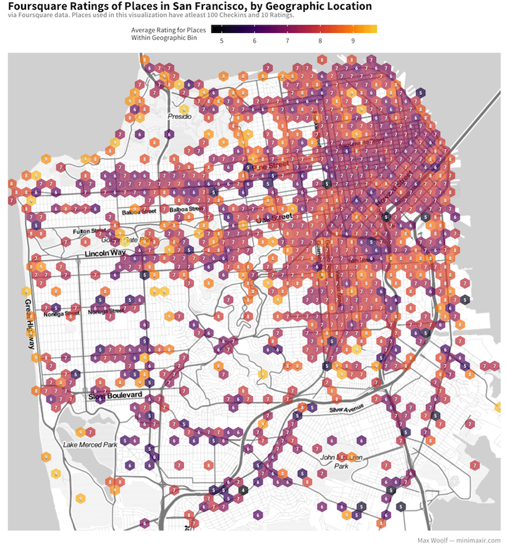

# foursquare-venue-scraper

A Foursquare data scraper that gathers all venues within a specified geographic area. The data retrieved can then be used for statistical analysis and fun data visualizations.

## Overview

The script queries the official Foursquare API (with a user-provided `client_id` and `client_secret`) to search for venue information, and then query additional metadata for each unique venue.

The specified area is defined by a geographic bounding box (by latitude and longitude). Since the API can only return up to 50 venues per search, the bounding box is broken into sub-bounding boxes as a form of grid search (by default, the `grid_size` is 100, so 100x100=10000 searches total).

The output file is a CSV with the following fields:

* `id` — The Foursquare ID for the venue.
* `name` — The name of the venue.
* `categories` — The list of categories of the venue.
* `lat` — Latitude
* `long` — Longitude
* `num_checkins` — Number of Foursquare Checkins
* `num_likes` — Number of Foursquare Likes
* `price` — Price Tier between 1-4 (i.e. $-$$$$)
* `rating` — Rating for the venue.
* `num_ratings` — Number of ratings for the venue.
* `url_venue` — URL of the venue.
* `url_foursquare` — URL for the Foursquare venue.

A demo CSV of the Top 100 San Francisco venues (by number of checkins) is available in `foursquare_sf_sample.csv`.

## Usage

Set the parameters in `config.yaml` as appropriate, then run `foursquare_venues.py`.

The Foursquare API has a **daily [rate limit](https://developer.foursquare.com/docs/api/troubleshooting/rate-limits) of 1,000 requests/day** for free accounts, but with verification, the rate limit upgrades to **100,000/day**. You can test the script with a small bounding box/low grid size to see if it fits your needs before upgrading.

Both of the API endpoints used in this script have a **rate limit of 5,000 requests/hour**. Once the script hits that limit, it'll sleep for an hour. Plan scraping accordingly.

## Foursquare Terms of Use

This script follows the specifications of the Foursquare API, and does not circumvent the API and its rate limits. If you're using the data for things other than data analysis, make sure to follow the [Foursquare Terms of Use](https://developer.foursquare.com/docs/terms-of-use/overview).

## Maintainer

Max Woolf ([@minimaxir](http://minimaxir.com))

*Max's open-source projects are supported by his [Patreon](https://www.patreon.com/minimaxir). If you found this project helpful, any monetary contributions to the Patreon are appreciated and will be put to good creative use.*

## License

MIT